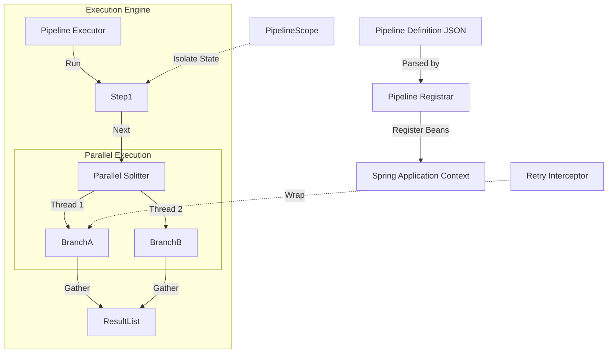

Here is a comprehensive, professional **README.md** for the `dih-core-starter` library. It documents the architecture, usage, configuration, and advanced features we have implemented.

You can save this as `README.md` in the root of your `dih-core-starter` module.

-----

# Dynamic Integration Hub (DIH) Core

**DIH Core** is a lightweight, high-performance **Dynamic Orchestration Engine** built on top of the Spring Boot ecosystem. It allows developers and analysts to define complex, parallel data integration pipelines using declarative JSON/YAML configurations, while maintaining the robustness and type safety of Java.

Unlike traditional hard-coded services, DIH treats business logic as composable "blocks" that can be rearranged, reconfigured, and executed in parallel without recompiling the code.

-----

## 🚀 Key Features

* **Dynamic Bean Registration:** Pipelines are defined in JSON and registered as standard Spring Beans at runtime.
* **Process Isolation (`@PipelineScope`):** A custom Spring Scope ensures that stateful components are isolated per execution thread. Multiple pipelines can use the same component classes concurrently without race conditions.
* **Scatter-Gather Concurrency:** Native support for parallel execution via `ParallelSplitterStep`. Splits tasks, executes them in a managed thread pool, and aggregates results automatically.
* **Declarative Fault Tolerance (AOP):** Configure retry policies (max attempts, delay) directly in JSON. The engine wraps steps in dynamic proxies to handle transient failures.
* **Context Propagation:** Automatic propagation of Execution IDs and MDC (logging context) from parent threads to child threads, ensuring full traceability.
* **Observability:** Structured logging with SLF4J and built-in Micrometer metrics.

-----

## 🏗 Architecture

DIH Core operates as a library that extends the Spring Container.



-----

## 📦 Installation

Since this is a core library, include it in your worker service or application via Maven/Gradle.

### Maven

```xml
<dependency>
    <groupId>org.example</groupId>
    <artifactId>dih-core-starter</artifactId>
    <version>1.0-SNAPSHOT</version>
</dependency>
```

-----

## ⚙️ Configuration

Configure the internal thread pool for parallel execution in your `application.yml` or `application.properties`.

```yaml
dih:
  executor:
    core-pool-size: 10      # Min active threads
    max-pool-size: 50       # Max burst threads
    queue-capacity: 100     # Queue size before rejection
    thread-name-prefix: "dih-worker-"
```

-----

## 📖 Usage Guide

### 1\. Create a Custom Step

Implement the `PipelineStep<I, O>` interface. The component must be stateless or rely on `@PipelineScope` for state isolation.

```java
import org.example.step.PipelineStep;
import org.example.step.PipelineContext;

// Register input/output types
public class MyCustomSource implements PipelineStep<Void, String> {
    
    // Properties injected from JSON
    private String endpointUrl;

    public void setEndpointUrl(String endpointUrl) {
        this.endpointUrl = endpointUrl;
    }

    @Override
    public String execute(Void input, PipelineContext context) {
        System.out.println("Executing pipeline: " + context.pipelineName());
        return "Fetched data from " + endpointUrl;
    }
}
```

### 2\. Register the Step Type

Map the symbolic name used in JSON to the Java class.

```java
@Configuration
public class DihConfig {
    @Bean
    public CommandLineRunner registerSteps(StepTypeRegistry registry) {
        return args -> {
            registry.register("HttpSource", MyCustomSource.class);
            registry.register("LogSink", MyLoggerSink.class);
        };
    }
}
```

### 3\. Define the Pipeline (JSON)

The pipeline definition controls the flow.

```json
{
  "name": "DataIngestionFlow",
  "steps": [
    {
      "id": "fetch-data",
      "type": "HttpSource",
      "properties": {
        "endpointUrl": "https://api.example.com/data"
      },
      "retryPolicy": {
        "maxAttempts": 3,
        "delay": 1000
      }
    },
    {
      "id": "save-data",
      "type": "LogSink",
      "properties": {}
    }
  ]
}
```

### 4\. Execute

Inject `PipelineExecutor` and run the definition.

```java
@Autowired
private PipelineExecutor executor;

public void run() {
    PipelineDefinition def = ...; // Load from JSON
    executor.executePipeline(def);
}
```

-----

## 🔥 Advanced Features

### Parallel Execution (Scatter-Gather)

Use the built-in `ParallelSplitter` type to run branches concurrently. The step waits for all branches to finish and returns a `List<Object>` containing the results.

**Fail-Fast Behavior:** If any branch fails, the main pipeline is immediately aborted with a `PipelineConcurrencyException`.

```json
{
  "id": "parallel-processing",
  "type": "ParallelSplitter",
  "subSteps": [
    { "id": "branch-a", "type": "HeavyProcessor", "properties": {...} },
    { "id": "branch-b", "type": "HeavyProcessor", "properties": {...} }
  ],
  "properties": {
    "subStepIds": ["branch-a", "branch-b"]
  }
}
```

### Context Injection

You can inject runtime metadata (Execution ID, Start Time) directly into your step fields using annotations.

```java
public class AuditingStep implements PipelineStep<Object, Object> {
    
    @InjectDynamicContext
    private String executionId;

    @InjectDynamicContext
    private long startTime;

    @Override
    public Object execute(Object input, PipelineContext context) {
        // executionId is automatically populated before this method runs
        return input;
    }
}
```

-----

## 🛡 Error Handling

DIH Core uses a strict hierarchy of exceptions to distinguish between configuration errors and runtime failures:

* `PipelineConfigurationException`: Invalid JSON, missing step types, or Spring wiring issues.
* `StepExecutionException`: Business logic failures inside a step.
* `PipelineConcurrencyException`: Failures occurred in a parallel thread.
* `RetryExhaustedException`: A step failed even after all configured retry attempts.

-----

## 📊 Monitoring & Logging

Logs are automatically enriched with MDC contexts.
**Example Log Output:**

```text
INFO  [execution.id=550e8400-e29b pipeline.name=OrderFlow] Starting Pipeline...
DEBUG [execution.id=550e8400-e29b pipeline.name=OrderFlow] Executing step: fetch-data
WARN  [execution.id=550e8400-e29b pipeline.name=OrderFlow] Attempt 1/3 failed for step 'fetch-data'. Retrying...
INFO  [execution.id=550e8400-e29b pipeline.name=OrderFlow] Pipeline finished successfully.
```

-----

## 🛣 Roadmap

* [x] **Core Engine:** DIH Core Starter (v1.0)
* [ ] **Worker Service:** REST API wrapper for the engine.
* [ ] **Manager Service:** Distributed control plane and load balancer.
* [ ] **UI Dashboard:** Visual pipeline builder.

-----

## 📝 License

This project is licensed under the MIT License.